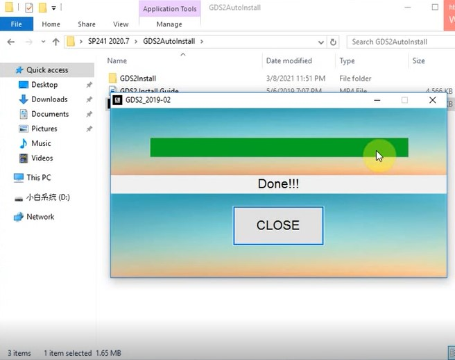

#GM

__ GM GDS2 Installation package DownLoad __

<a target="_blank" href="https://mega.nz/#F!jN4lSYaA!5Q_p4sZEySxLu6HVPP418A" >MEGA Cloud </a> 

<a target="_blank" href="https://pan.baidu.com/s/1twAt4XST5W5oFd4WKYVmjQ" >Baidu network disk</a> code：peix 

***

__ GM THCH2WIN Installation package DownLoad __

<a target="_blank" href="https://mega.nz/#!tIFWUIxT!XBAFZWEFPhQ3A9MtyPYfT1wojVgB1sEmt2T62nrmQcM" >MEGA Cloud </a> 

<a target="_blank" href="https://pan.baidu.com/s/12A-2Q_OY8-8akK0yYV0GNg" >Baidu network disk</a> code：m1ns 

***

__ GDS2 Patch DownLoad __

 (2021.03.01) <a target="_blank" href="https://mega.nz/file/oZ820RCJ#BXRW3mOGCC7mfMjtaJ71AzjwghBlCogoM7RNGWi9KmE" >MEGA Cloud </a> 

***

__ GDS2 Virtual Machine DownLoad __

 GDS2_2016-10 <a target="_blank" href="https://mega.nz/#!RRVi1YiR!Cux39gxtbGnzFhKA5LElEcVjjNNg5Eb2huNxlngEv1E" >MEGA Cloud</a> 

 GDS2_2018-01 <a target="_blank" href="https://mega.nz/#F!Q0Aj1BqI!iW1YeXoS9RjKTk9FEKkkAA" >MEGA Cloud</a> 

 GDS2_2016 <a target="_blank" href="https://pan.baidu.com/s/1P1qCzEyyjKD2tou1_C3xRQ" >Baidu network disk</a> code：xqd9 

 GDS2_2018_CN <a target="_blank" href="https://pan.baidu.com/s/1CUeyoWDCd4reC4w18_ZDqQ" >Baidu network disk</a> code：97sj 

***

#GDS2 and Tech2win Installation guide

## 1.install GDS2 

<iframe width="560" height="315" src="https://www.youtube.com/embed/WrzPriILVaU" title="YouTube video player" frameborder="0" allow="accelerometer; autoplay; clipboard-write; encrypted-media; gyroscope; picture-in-picture" allowfullscreen></iframe>

### open the GDS2Autoinstall folder, run GDS2Autoinstall.exe.

### install Done, click[CLOSE]

## 2.install Tech2win

### Open Tech2win folder. run Autoinstall.exe

### select [Always trust software from "gm.com"]，and click [Install]

### click [OK]

## 3.install VX Manager

### run VX Manager.exe

### select [GM]，and then click [Next]

### GM driver install complete,click [Close]

### click [Finish]

## 4.Start VX Manager

### run VX Manager on the desktop

### Make sure you your computer network is good. Connect your device by USB cable to computer and OBD2 Socket to your ECU Bench connector or Your car’s OBD2 Port.

### click [Diagnostic]

### click PASSTHRU，and then click [Install]

### Install Passthru driver.

### click [Device]，and then click [Licenses]

### Check your device license. If your license expired, please feel free to contact us to extend for free.

### click [Firmware] to update the Firmware.

### click [Update License] to update the License

## 5.Start GDS2

### run GDS2 on the desktop

## 6.Start Tech2win

### Run Tech2win as administrator

